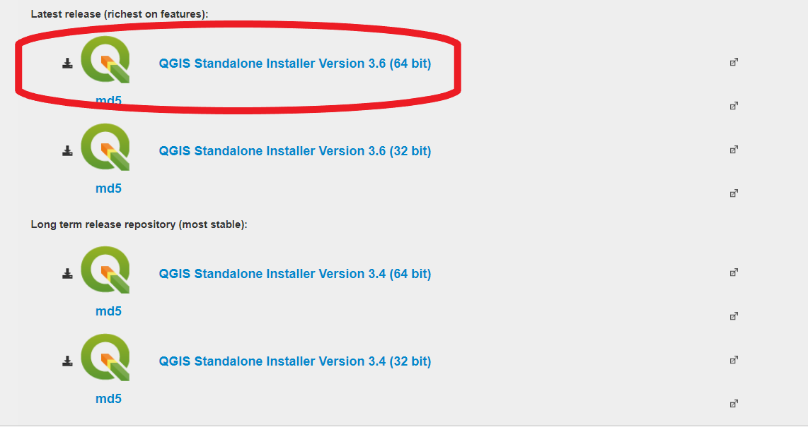
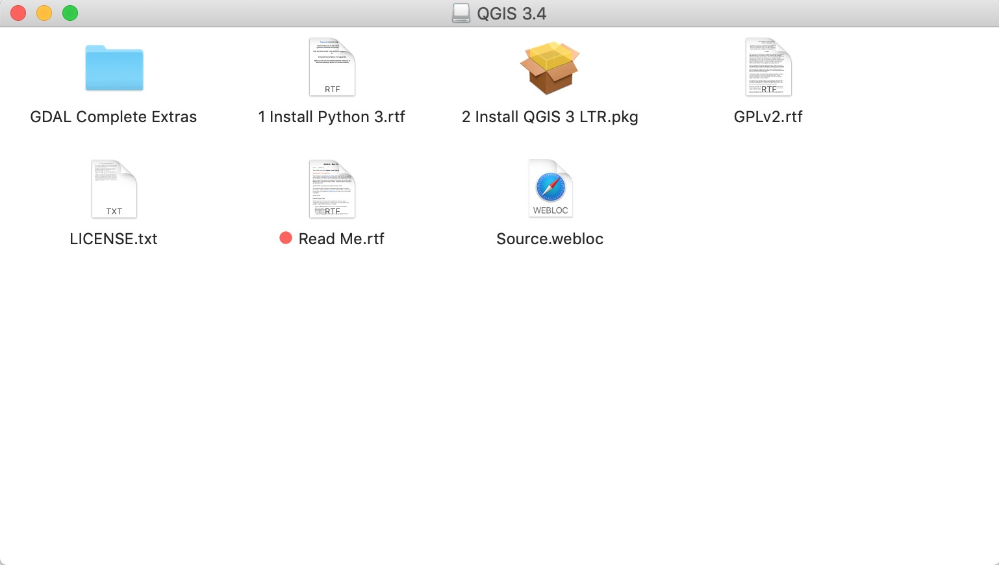

# QGIS

[QGIS](http://www.qgis.org/en/site/) is a free and open source Geographical Information System. 

## Download
* Download __QGIS Version 3.6__ from https://qgis.org/en/site/forusers/download.html:

## Windows Install:

1. [Download](#download)

2. Follow the instructions provided by the installer you downloaded.  

3. [Test install](#test-install)

## Mac OS/X:

1. Before installing QGIS, you **must** first install Python 3.6. Use the [64-bit installer](https://www.python.org/ftp/python/3.6.8/python-3.6.8-macosx10.9.pkg) if you're using MacOS 10.9 or later, or the [64-bit/32-bit installer](https://www.python.org/ftp/python/3.6.8/python-3.6.8-macosx10.6.pkg) if you're using an earlier version of MacOS.

2. [Download](#download)

3. When you click on the installer, you will see this page (the image shows version 3.4, but the image will be nearly identical for version 3.6):

 Double-click on `Install QGIS 3 LTR.pkg` to install the software.

4. [Test install](#test-install)

#### Troubleshooting
You may need to change [security & privacy settings](https://support.apple.com/en-us/HT202491) to allow app downloads from outside sources.

## Test Install
 Launch __QGIS 3.6 Desktop 3.6.0__. A new project will look like this:

Instructions are modified from [Michelle A. McSweeney](https://github.com/michellejm/Intro-QGIS-CUNY-FemSTEM/blob/master/Install-QGIS.md)

